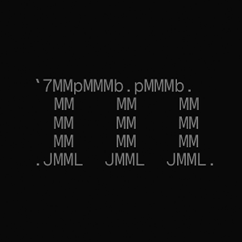

<p align="center">
  
</p>

# Molly Discord Relay

Realtime Discord relay backend that connects Discord to terminal clients via WebSockets and REST APIs.

## ⚠️ Security & Trust Model

> **This relay holds a Discord bot token with privileged gateway intents.**
> Anyone connecting through the relay is trusting the relay operator for message
> confidentiality and identity integrity. The relay can read every message in
> every channel the bot is in, and it stores webhook tokens in its local SQLite
> database.

**What the bot token allows:**
- Reading all messages (via `MessageContent` intent)
- Seeing all server member lists (via `GuildMembers` intent)
- Seeing typing activity (via `GuildMessageTyping` intent)
- Creating/executing webhooks to post messages on behalf of users

**Mitigations in place:**
- All API endpoints require an `X-API-Key` header with a strong shared secret
- The API key is compared in constant time to prevent timing attacks
- Webhook tokens are stored only in the local database, not transmitted to clients
- CORS is restricted to the configured origin (`https://molly.ploglabs.com`)

**Recommendation:** Self-host this relay if you require full control. The relay
operator can see all traffic passing through it.

## Architecture

```
Terminal Client → WebSocket/REST → Molly Relay → Discord Gateway/API → Discord Channels
```

## Run locally

### Prerequisites

- [Go](https://go.dev) 1.21+
- A [Discord application](https://discord.com/developers/applications) with a bot

### Discord bot setup

1. Create a Discord application at the [Developer Portal](https://discord.com/developers/applications)
2. Go to **Bot** → **Add Bot**
3. Enable **Privileged Gateway Intents**: Message Content, Server Members, Presence
4. Go to **OAuth2** → **URL Generator**, select `bot`, grant: Read Messages, Send Messages, Read Message History, Add Reactions
5. Invite the bot to your server using the generated URL

### Setup

```bash
git clone https://github.com/ploglabs/molly-discord-relay.git
cd molly-discord-relay
cp .env.example .env
```

Fill in `.env`:

```env
DISCORD_TOKEN=your_bot_token
PORT=8080
DATABASE_PATH=./molly.db
# Required — generate with: openssl rand -hex 32
API_KEY=your_strong_random_secret
```

### Run

```bash
make build
./bin/molly-discord-relay
```

Server starts on `http://localhost:8080`.

## API Endpoints

All endpoints require the `X-API-Key` header set to your configured `API_KEY`.

| Method | Path | Description |
|--------|------|-------------|
| `POST` | `/message` | Send a message to a Discord channel |
| `GET` | `/history?channel=&limit=` | Fetch message history |
| `POST` | `/status` | Update developer status |
| `GET` | `/api/guilds` | List available guilds |
| `WS` | `/ws` | Realtime WebSocket event stream |

**Example:**
```bash
curl -H "X-API-Key: $API_KEY" https://your-relay/api/guilds
```

> **Note:** The API key must be sent in the `X-API-Key` header only.
> Query-string delivery (`?api_key=...`) is not supported because keys in URLs
> appear in access logs, proxy logs, and browser history.

```json
{
  "type": "message_create",
  "channel": "general",
  "username": "arnav",
  "content": "hello world",
  "timestamp": "2026-05-11T10:00:00Z"
}
```

Event types: `message_create`, `message_update`, `message_delete`, `typing_start`, `user_join`, `user_leave`, `status_update`.

## Install (pre-built)

**macOS**: `brew install ploglabs/tap/molly-discord-relay`

**Arch**: `yay -S molly-discord-relay-bin`

**Go**: `go install github.com/ploglabs/molly-discord-relay/cmd@latest`

See [GitHub Releases](https://github.com/ploglabs/molly-discord-relay/releases) for deb/rpm packages.

## Systemd service (Linux)

```bash
sudo tee /etc/systemd/system/molly-relay.service <<'EOF'
[Unit]
Description=Molly Discord Relay Server
After=network.target

[Service]
Type=simple
WorkingDirectory=/opt/molly-relay
EnvironmentFile=/opt/molly-relay/.env
ExecStart=/usr/bin/molly-discord-relay
Restart=always
RestartSec=5

[Install]
WantedBy=multi-user.target
EOF

sudo systemctl daemon-reload
sudo systemctl enable --now molly-relay
```

## License

[Apache License 2.0](LICENSE)
